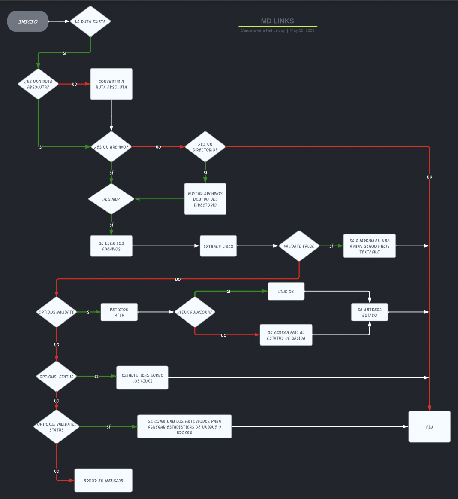

# Markdown Links

***
Esta es una herramienta de línea de comando (CLI) y biblioteca que permite buscar y analizar enlaces en archivos `Markdown` (.md). Está desarrollada en `Node.js` y utiliza la API de Fetch para realizar solicitudes __HTTP__ y validar los enlaces. También incluye pruebas unitarias con `Jest` para garantizar la calidad del código. Puedes instalarla fácilmente a través de __npm__.


## 1. Instalación 

Para instalar debes ejecutar el siguiente comando en tu terminal: 
```sh
npm i md-links-carolina-vera
```
Esta listo! ya utilizar la biblioteca

## 2. Modo de uso

Desde tu terminal utliza el siguiente comando 
```sh
md-links <ruta_de_archivo_o_directorio> [--validate] [--stats]
```
El parámetro inicial es `md-links`, es la palabra clave con la que nuestra biblioteca inicia su funcionamiento. Luego, continuamos con`<ruta_de_archivo_o_directorio>`, que representa la ruta del archivo o directorio del cual deseas obtener la información. Por último, puedes agregar `--validate` y/o `--stats` según los datos que desees obtener.

### Ejemplo de uso

* Para **extraer** los links de un archivo debes ejecutar el siguiente comando:
```sh
md-links README.md
```
* Para **validar** los links de un archivo debes ejecutar el siguiente comando:
```sh
md-links README.md --validate
```
* Para obtener **estadísticas** de los links de un archivo debes ejecutar el siguiente comando:
```sh
md-links README.md --stats
```
* Para obtener **estadísticas** y **validar** los links de un archivo debes ejecutar el siguiente comando:
```sh
md-links README.md --stats --validate 
```
## 1. Diagrama de flujo
Aqui puedes encontrar el diagrama de flujo de este proyecto


[Markdown](https://es.wikipedia.org/wiki/Markdown)

